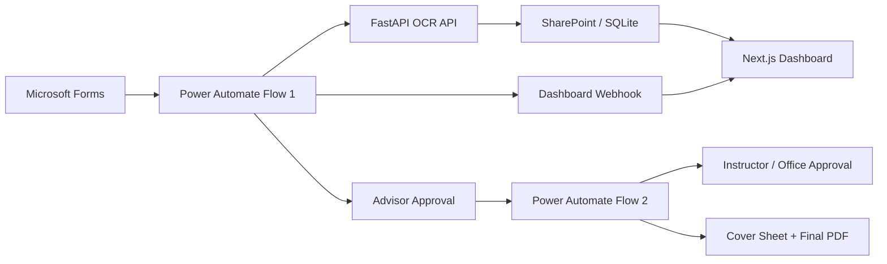

# Document AI Approval Pipeline

Portfolio-safe copy of a final-year project that automates student petition workflows:

- Microsoft Forms intake
- OCR extraction with FastAPI + Gemini Vision
- multi-step approvals in Microsoft Teams / Power Automate
- SharePoint-backed request tracking
- Next.js dashboard for monitoring status

The original project was built for Kasetsart University Sriracha Campus. This repository is a curated public version with secrets, tenant-specific IDs, signed webhook URLs, and personal contact details removed.

## Highlights

- OCR API for PDF and image uploads
- Power Automate webhook endpoint for Microsoft 365 flows
- cover sheet and final document PDF generation
- dashboard with table, kanban, stats, and API connection modes
- smoke-tested backend utilities suitable for demo and extension

## Architecture



## Repo Layout

```text
github_portfolio/
|- main.py
|- config.py
|- ocr_service.py
|- requirements.txt
|- templates/
|- tests/
|- dashboard/
|- automation/
|- docs/
|- forms/specs/
`- ground_truth/
```

## Backend Quick Start

```bash
python -m venv .venv
.venv\\Scripts\\activate
pip install -r requirements.txt
copy .env.example .env
uvicorn main:app --reload
```

API docs will be available at [http://127.0.0.1:8000/docs](http://127.0.0.1:8000/docs).

## Dashboard Quick Start

```bash
cd dashboard
copy .env.example .env.local
npm install
npm run dev
```

The dashboard expects the backend at `NEXT_PUBLIC_API_URL`. Default local setup points to `http://127.0.0.1:8000`.

## Testing

Run the smoke suite:

```bash
python -m pytest tests/test_smoke.py -q
```

This repo intentionally ships a focused smoke test rather than the full internal test suite, because the original workspace still contains older tests for deprecated endpoints and earlier OCR implementations.

## Automation References

The [`automation/`](./automation) directory contains sanitized reference files for Flow 1 and Flow 2. They are meant for architecture review and portfolio presentation, not direct tenant import.

## Public Release Notes

- real API keys and signed Power Automate callback URLs removed
- real user emails and tenant identifiers removed
- raw workspace artifacts, temp exports, caches, and local tooling removed
- dashboard URLs converted to environment-driven placeholders

See [`docs/architecture.md`](./docs/architecture.md) and [`docs/security-and-sanitization.md`](./docs/security-and-sanitization.md) for more detail.
